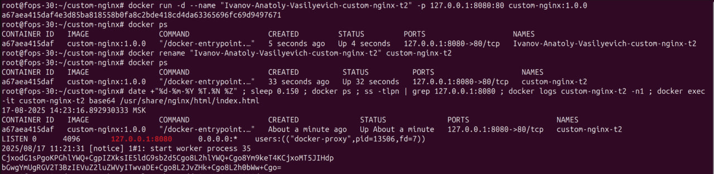
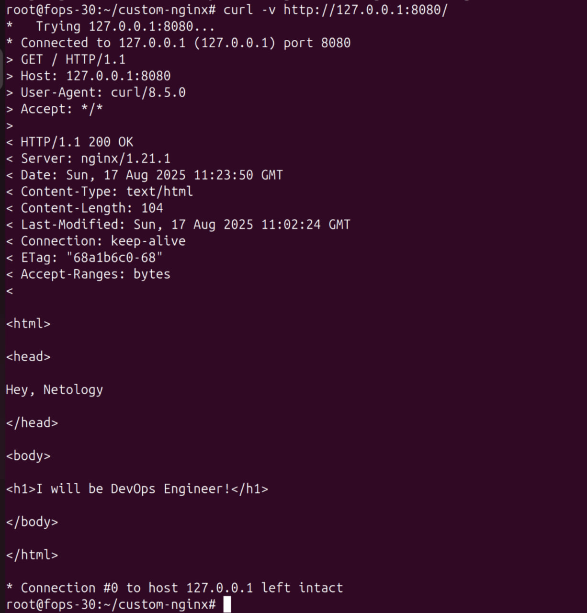
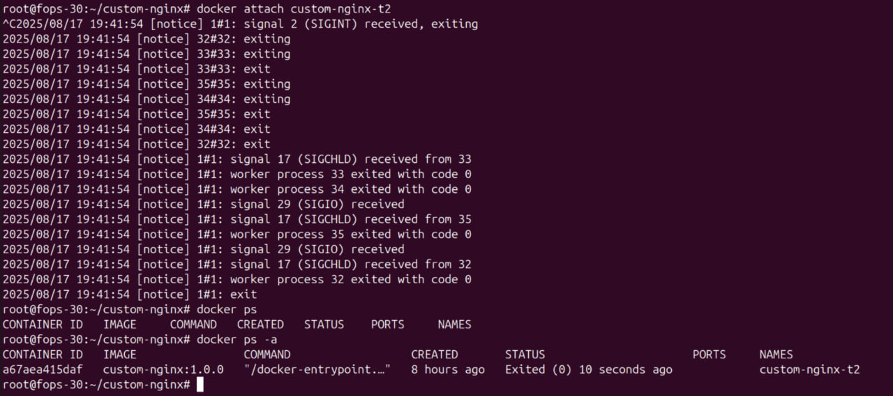
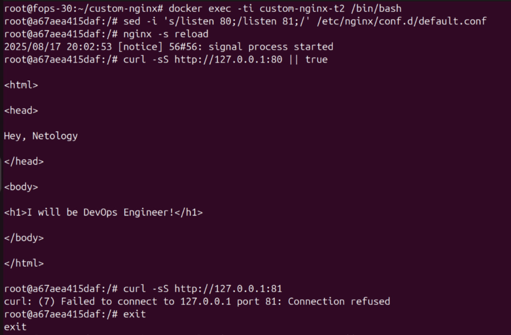
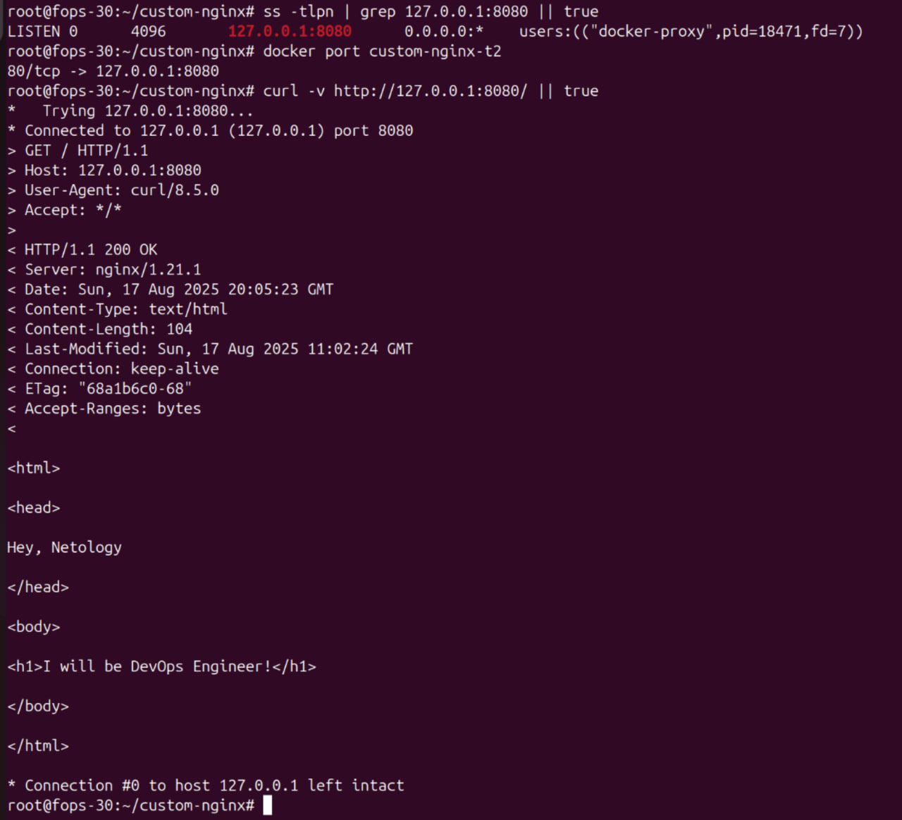
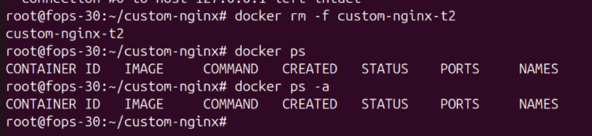

# Домашнее задание к занятию 4 «Оркестрация группой Docker контейнеров на примере Docker Compose»

### Задача 1

Ссылка на образ докер nginx
https://hub.docker.com/repository/docker/drumlast/custom-nginx/general

### Задача 2




### Задача 3

Подключаемся к STDIN/STDOUT/STDERR контейнера с помощью команды docker attach


Контейнер остановился потому что docker attach присоединяет клавиатуру к PID 1 процесса в контейнере (у nginx это master-процесс). Сигнал SIGINT (Ctrl-C) прилетает в главный процесс, и тот завершает работу — контейнер считается остановленным, так как завершился его основной процесс.

Проверка с хоста с объяснением проблемы:  «сломалось» потому, что при старте был публиковал порт так: -p 127.0.0.1:8080:80. Это проброс порта хоста 8080 внутри контейнера га порт 80. После правки nginx слушает 81, а проброс остался на 80, где теперь никто не слушает — поэтому curl 127.0.0.1:8080 падает.



```
docker rm -f custom-nginx-t2
```


### Задача 4

