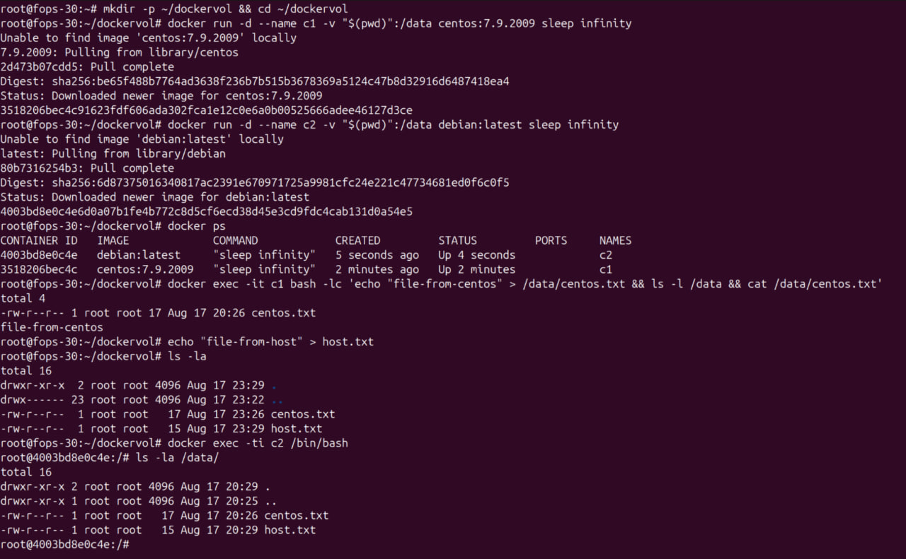
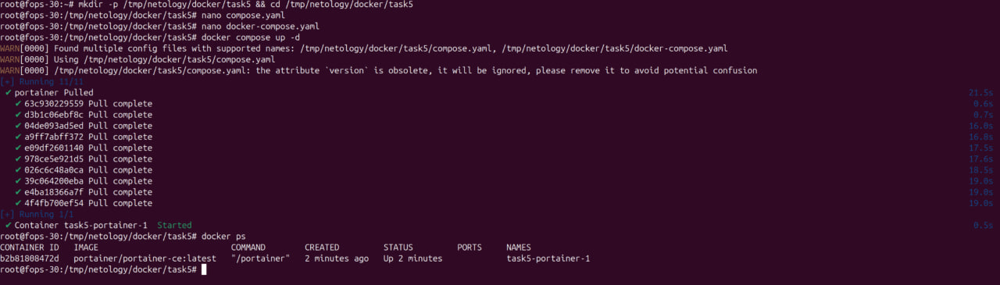
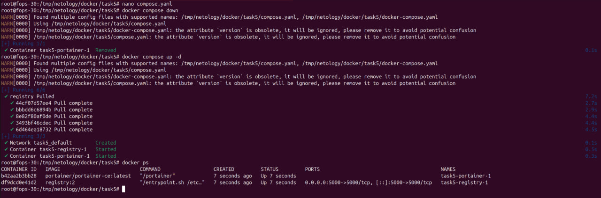
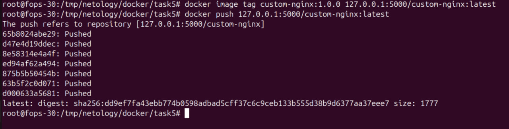
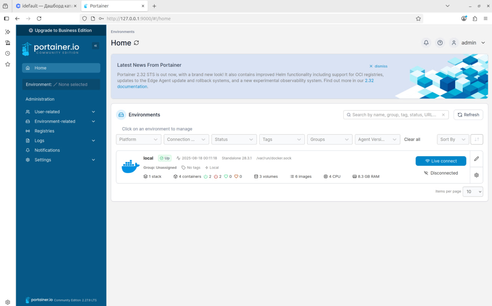
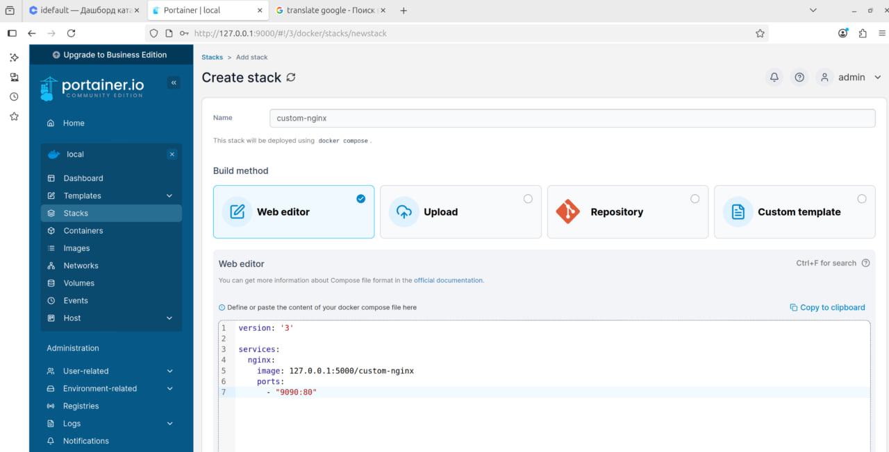
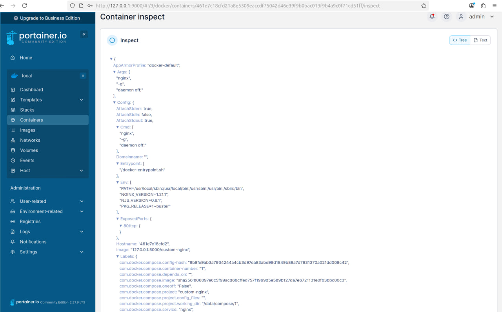
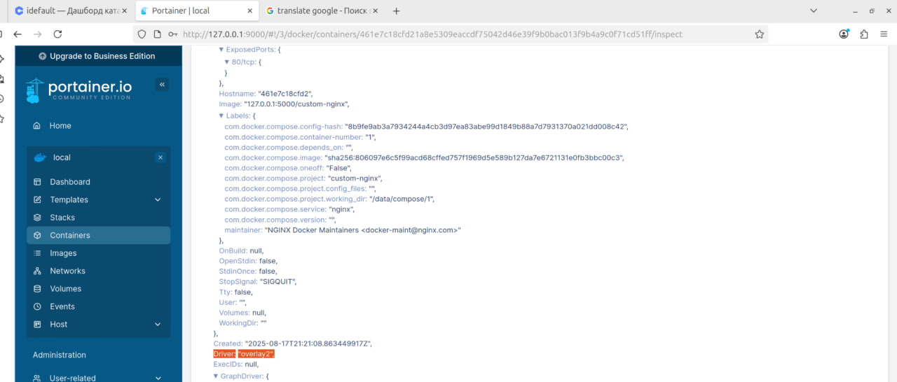
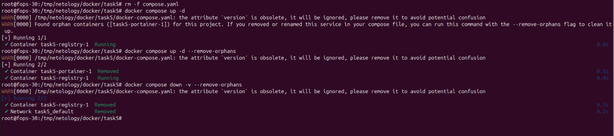

# Домашнее задание к занятию 4 «Оркестрация группой Docker контейнеров на примере Docker Compose»

### Задача 1

Ссылка на образ докер nginx
https://hub.docker.com/repository/docker/drumlast/custom-nginx/general

### Задача 2


### Задача 3

Подключаемся к STDIN/STDOUT/STDERR контейнера с помощью команды docker attach


Контейнер остановился потому что docker attach присоединяет клавиатуру к PID 1 процесса в контейнере (у nginx это master-процесс). Сигнал SIGINT (Ctrl-C) прилетает в главный процесс, и тот завершает работу — контейнер считается остановленным, так как завершился его основной процесс.

Проверка с хоста с объяснением проблемы:  «сломалось» потому, что при старте был публиковал порт так: -p 127.0.0.1:8080:80. Это проброс порта хоста 8080 внутри контейнера га порт 80. После правки nginx слушает 81, а проброс остался на 80, где теперь никто не слушает — поэтому curl 127.0.0.1:8080 падает.


```
docker rm -f custom-nginx-t2
```


### Задача 4



### Задача 5

Команда docker compose up -d по умолчанию читает файлы в порядке приоритета: compose.yaml, compose.yml, docker-compose.yaml, docker-compose.yml.
Значит, будет запущен только compose.yaml (Portainer), потому что он имеет более высокий приоритет.


Здесь уже запущены 2 файла: compose.yaml и docker-compose.yaml


----------------------------------------





-----------------------------------------

Compose обнаружил «осиротевшие» сервисы/контейнеры (например, portainer), которые были в ранее использованном файле, но не описаны в текущем. Предлагается удалить «orphans», чтобы состояние соответствовало текущему манифесту.
```
docker compose up -d --remove-orphans
```